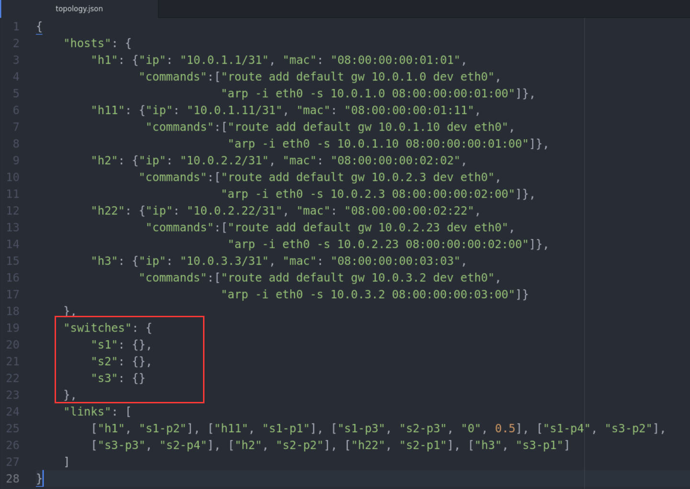
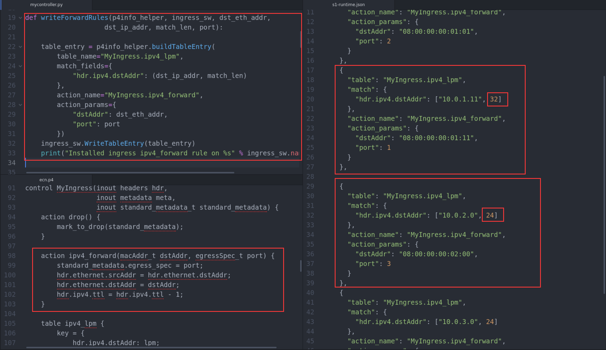
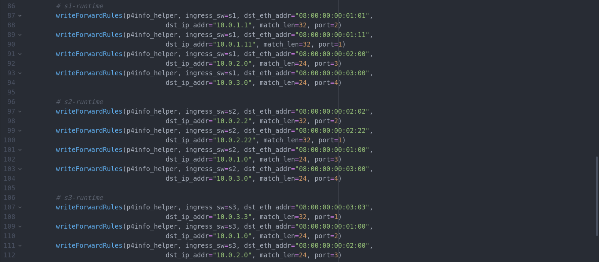
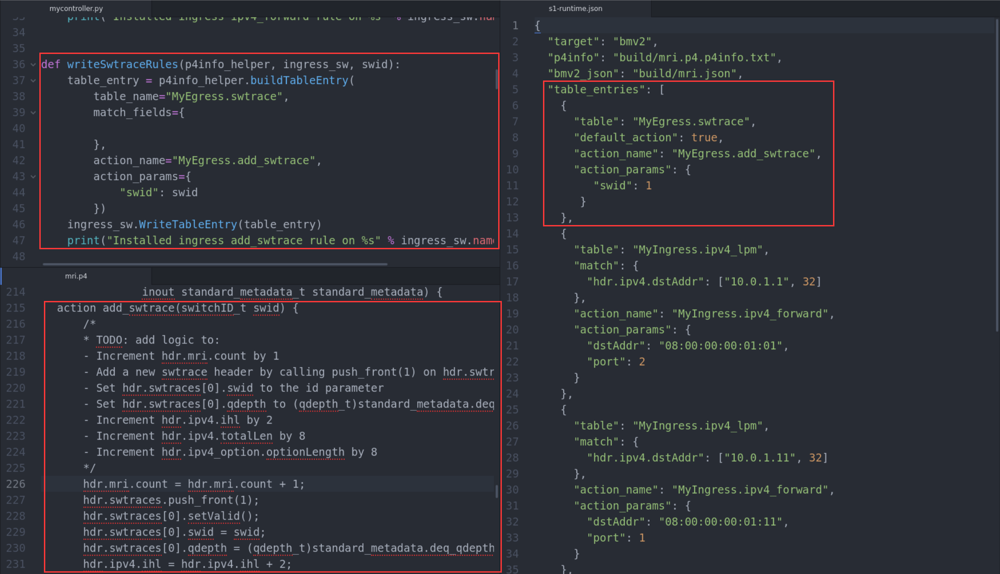
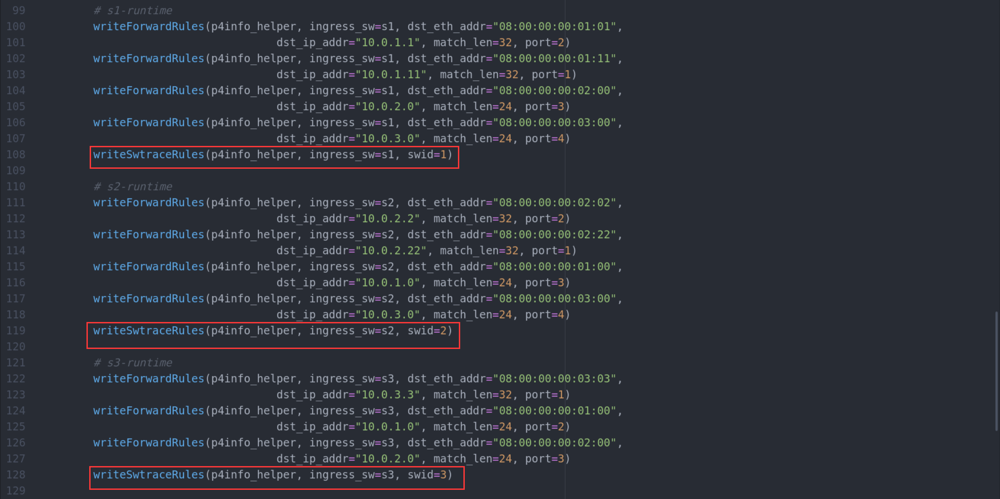

题目要求将流规则用 p4runtime 动态下发，我们先将 topology.json 文件中对 s1,s2,s3 描述的 sx-runtime 删掉

然后编写 mycontroller.py 文件。

+ 在 ecn 中

  根据 sx-runtime 和 p4 中相关 action 的内容为交换机写函数

  我们观察到有 dstAddr 和 port 两个参数，以及匹配 ipv4 的地址长度有 24 和 32

  

  接着利用写好的函数为每个交换机添加 sx-runtime 中的信息

  

+ 在 mri 中

  mri 和 ecn 的 sx-runtime 大致相同，就是在 MyEgress 中多了一个 table

  我们为 table 中的 action add_swtrace 写于一个函数，它只有一个参数 swid 

  

  接着利用写好的函数为每个交换机添加 sx-runtime 中的信息

  